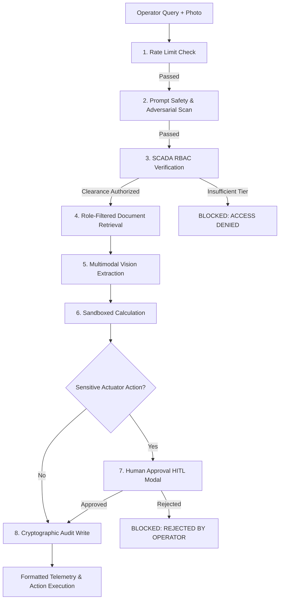

# 🛡️ Sovereign Workbench — On-Premise Agentic AI Console

<p align="center">
  
  
  
  
</p>

> **Confidential Industrial Operations & Multimodal Safety Workbench**  
> An on-premise, defense-in-depth operator console and backend prototype being engineered for high-consequence operational technology (OT) environments (thermal power generation, chemical loops, and automated manufacturing). Enables maintenance operators to query technical manuals, analyze visual gauge telemetry, perform deterministic thermodynamic calculations, and trigger physical actuators under strict Human-in-the-Loop (HITL) authorization and cryptographic tamper-proof logging.

---

## 📑 Table of Contents

- [Phased Implementation Roadmap & Current Status](#-phased-implementation-roadmap--current-status)
- [Problem Statement & Background](#-problem-statement--background)
- [Key Architectural Features](#-key-architectural-features)
- [Visible 8-Stage Defense Pipeline](#-visible-8-stage-defense-pipeline)
- [SCADA Role-Based Access Control (RBAC)](#-scada-role-based-access-control-rbac)
- [Operator User Profile & Dropdown Console](#-operator-user-profile--dropdown-console)
- [Repository Structure](#-repository-structure)
- [Quick Start Guide](#-quick-start-guide)
- [Interactive Demo Scenarios](#-interactive-demo-scenarios)
- [Cryptographic Audit Hash Chain](#-cryptographic-audit-hash-chain)
- [Security Standards & Design Alignment](#-security-standards--design-alignment)

---

## 🚦 Phased Implementation Roadmap & Current Status

This repository is being built across 8 deliberate engineering phases:

- [x] **Phase 0 — Environment & Repo Foundation**: FastAPI project skeleton, configuration management, automated health check endpoints (`/health`).
- [x] **Phase 1 — Real Auth, RBAC & Server-Side Audit Trail**: Argon2id password hashing, stateless JWT issuance with `role` + `clearance_level`, deterministic plant capability map (L1/L2/L3 equipment checks), per-user token-bucket rate limiter, Alembic database migrations, and concurrency-locked SHA-256 hash-chained audit ledger (`/auth`, `/query`, `/audit`). Fully verified via automated test suites.
- [ ] **Phase 2 — Prompt Guard (Llama-Guard-3)**: Input safety screening layer situated ahead of RBAC (Step 2) to block and audit prompt injections and adversarial attacks. *(Active Phase)*
- [ ] **Phase 3 — Real Document Retrieval ("Iron Vault")**: Qdrant vector database with local embedding model, clearance-tagged manual chunks, and query-time pre-filtering (`clearance_level <= user_level`).
- [ ] **Phase 4 — Vision & Sandboxed Calculation**: Local Qwen2.5-VL gauge-reading extraction from photos and isolated container sandbox for deterministic $\Delta p$ pressure drop calculation.
- [ ] **Phase 5 — Planner & Orchestration**: LangGraph + Qwen 2.5 local reasoning loop with static capability-map allowlist guardrails and `interrupt()` execution for sensitive actions.
- [ ] **Phase 6 — HITL Streaming & Frontend Rewiring**: Server-Sent Events (`/query/{id}/stream`), human authorization decision endpoints (`/approvals/{id}/decision`), and rewiring `script.js` from client-side `setTimeout` simulation to real backend SSE events.
- [ ] **Phase 7 — Comprehensive Security Review & E2E Validation**: Input validation, photo upload safety, dependency audit, and automated end-to-end integration tests.
- [ ] **Phase 8 — Final Deployment & Production Verification**: Multi-container Docker Compose deployment on dedicated GPU hardware and verified operational checklist.

---

## 🏭 Problem Statement & Background

In critical infrastructure and high-consequence industrial facilities, generative AI models cannot be connected to public cloud APIs due to:
1. **Data Confidentiality & Air-Gapping**: Plant schematics, operating manuals, and telemetry data must never egress the local network.
2. **Safety & Hallucination Prevention**: Actuator commands (such as opening high-pressure steam valves or adjusting reactor coolant loops) can cause catastrophic physical damage if triggered by hallucinated outputs or prompt injections.
3. **Regulatory Non-Repudiation**: Every query, reasoning step, and physical action must produce a cryptographically verifiable, legally immutable audit trail.

**Sovereign Workbench** provides a sovereign, on-premise operator interface where open-weight multimodal models run locally inside an isolated network. Every query is filtered through a visible defense pipeline before inference, execution, or physical actuation is permitted.

---

## ⚡ Key Architectural Features

- 💬 **Conversational Operator UX**: ChatGPT & Claude-style layout with past chat grouping (`Today`, `Yesterday`, `Previous 7 days`), seamless chat creation, and auto-resizing prompt input.
- 🧠 **Vertical Agentic Activity Feed (Thought Process)**: Inspired by modern agentic development environments (Antigravity/Cursor), queries display a live, collapsible timeline showing memory recall, tool loading, security checks, and calculation milestones.
- 🔒 **Dynamic Role-Based Access Control**: Physical equipment access is governed dynamically by the authenticated operator's clearance level.
- 🖼️ **Multimodal Optical Gauge Extraction**: Upload gauge and valve inspection photos (`boiler-102-gauge.jpg`) to extract visual pressure readings with confidence metrics.
- 🤝 **Dual-Key Human-in-the-Loop (HITL) Authorization**: Actions triggering physical actuators (e.g., `open_release_valve`) require explicit operator sign-off via modal authorization per **SOP 4.2.1**.
- ⛓️ **Merkle Hash-Chain Audit Ledger**: Every action commits an immutable block with parent SHA-256 hash linking, exportable to JSON for compliance review.
- 📦 **Zero-Framework Architecture**: Built with 100% pure HTML5, CSS3, and modern JavaScript. No npm installs, Webpack/Vite bundlers, or server runtimes required—runs directly via `file:///` in any modern web browser.

---

## 🛡️ Visible 8-Stage Defense Pipeline



1. **Rate Limit Check**: Token bucket algorithm verifies request cadence to prevent DDoS or telemetry flood.
2. **Prompt Safety Check**: Scans for adversarial injections, system prompt leak attempts, and jailbreaks.
3. **SCADA RBAC Verification**: Verifies if the operator's clearance permits querying or controlling the targeted subsystem (e.g. `boiler-102`, `turbine-gen-4`, `reactor-core`).
4. **Document Retrieval**: Retrieves role-filtered maintenance manuals and SOPs locally without internet access.
5. **Multimodal Vision Inspection**: Ingests gauge photos and extracts manifold readings with confidence scores.
6. **Sandboxed Calculation**: Deterministic calculation of pressure differential ($\Delta p$) in an isolated compute environment.
7. **Human Approval (HITL)**: Pops up a secondary authorization modal requiring affirmative human confirmation.
8. **Audit Log Write**: Computes and appends a SHA-256 Merkle-linked block into the permanent tamper-proof ledger.

---

## 👥 SCADA Role-Based Access Control (RBAC)

| Clearance Tier | Operator Title | Permitted Equipment | Restricted Equipment |
| :--- | :--- | :--- | :--- |
| **Level 1** | Maintenance Engineer | `boiler-102`, `pump-201`, `cooling-loop-c3` | `turbine-gen-4`, `reactor-core-aux` |
| **Level 2** | Systems Specialist | `boiler-102`, `pump-201`, `cooling-loop-c3`, `turbine-gen-4`, Compressors | `reactor-core-aux` |
| **Level 3** | Chief Safety Auditor | **All Units** (Full facility, governor overrides, emergency scram audit) | None |

### 1-Click Test Operator Profiles
- **Suketu Patel (Pro · L3)** &mdash; Lead Auditor · Full facility clearance across all systems.
- **J. Morrison (Engineer · L1)** &mdash; Maintenance Engineer · Restricted to `boiler-102` and non-critical loops.
- **Dr. Elena Vance (Specialist · L2)** &mdash; Systems Specialist · Authorized for Turbines and Compressors.

---

## ⚙️ Operator User Profile & Dropdown Console

The bottom of the sidebar features a profile pill matching modern conversational consoles:
- **Operator Avatar & Pill**: Shows initials (`SM`, `JM`, `EV`), operator name, and subscription tier (`Suketu · Pro ⌄`).
- **Upward-Opening Profile Menu**:
  - **Header**: Operator email (`suketu.2005@gmail.com`) and active RBAC tier badge.
  - ⚙️ **Settings** (`Ctrl ,`): Interface themes (System/Light/Dark), operator language, and local model weights (`Llama-3.3-70B`, `Mistral-Large`, `Qwen-Coder`).
  - 🌐 **Language**: Quick switch between English, Deutsch, Español, and Hindi.
  - ❓ **Get Help & SOP**: Standard Operating Procedure 4.2.1 safety protocol and console keyboard shortcuts.
  - 🛡️ **View System Clearances**: Live matrix of authorized vs. denied plant hardware units.
  - 📥 **Get Apps & CLI Tools**: Terminal command snippets and **Export Audit Trail (JSON)**.
  - 🎓 **Sovereign Academy**: 4 confidential AI operational training modules featuring the **`New`** badge.
  - ℹ️ **About Sovereign Workbench**: Air-gapped runtime specs, build hash, and compliance badges.
  - 🚪 **Log Out**: Instantly terminates active session and opens the authentication dialog.

---

## 📁 Repository Structure

```
.
├── index.html        # Clean semantic HTML5 markup (sidebar, chat views, modals, dialogs)
├── styles.css        # Vanilla CSS3 design system (light/dark modes, industrial tokens, animations)
├── script.js         # Reactive JavaScript application logic, defense pipeline, hash chain
├── .gitignore        # Standard Git exclusions
└── README.md         # Comprehensive project documentation
```

---

## 🚀 Quick Start Guide

Because Sovereign Workbench has **zero dependencies**, you can run it immediately on any machine without installing Node.js, Python, or external tools:

### Option 1: Open Locally in Browser
1. Clone or download this repository:
   ```bash
   git clone https://github.com/<your-username>/<repo-name>.git
   cd SIH
   ```
2. Double-click `index.html` or open it from terminal:
   ```powershell
   # Windows PowerShell
   Start-Process index.html

   # macOS
   open index.html

   # Linux
   xdg-open index.html
   ```

### Option 2: Run with Local HTTP Server (Optional)
```bash
# Using Python built-in server:
python -m http.server 8080

# Using Node npx:
npx serve .
```
Navigate to `http://localhost:8080`.

> [!NOTE]
> **Frontend Runtime Architecture**: The frontend console currently runs in interactive visual demo mode using client-side `setTimeout` simulations. The verified Phase 0/1 FastAPI backend is located under [`backend/`](file:///c:/Users/Arpit%20singh/OneDrive/Desktop/SIH/backend). In **Phase 6**, `script.js` will undergo a data-source swap to listen directly to real pipeline Server-Sent Events (SSE).

### Option 3: Run the FastAPI Backend (Phase 0/1)
```bash
cd backend
python -m uvicorn app.main:app --port 8000
```
Interactive Swagger UI documentation is available at **`http://localhost:8000/docs`**.

---

## 🧪 Interactive Demo Scenarios

### Scenario A: Boiler-102 Gauge Inspection & Release Valve Actuation
1. Click **PRE-LOAD DEMO SCENARIO** above the prompt bar.
2. An image chip for `boiler-102-gauge.jpg` is automatically attached alongside the query:
   ```
   Fetch boiler-102 log, read gauge photo, calculate pressure drop, open release valve if abnormal.
   ```
3. Click **Send** (or press <kbd>Ctrl</kbd> + <kbd>Enter</kbd>).
4. Watch the vertical defense pipeline verify rate limits, prompt safety, RBAC, retrieve the manual, extract the 6.4 bar gauge reading, and compute $\Delta p = 3.8\text{ bar}$.
5. When the sensitive action is reached, the **Human Authorization Required (HITL)** modal pops up.
6. Click **APPROVE** to commit entry `#0012` to the SHA-256 ledger and review the final response cards.

### Scenario B: Dynamic RBAC Clearance Halt
1. Open the user profile menu at the bottom-left and click **Log out**.
2. Sign in as **J. Morrison (Engineer · Level 1)**.
3. Type the query:
   ```
   Inspect turbine-gen-4 governor bearings and rotor clearance
   ```
4. Click **Send**.
5. The pipeline halts at **Step 3 (RBAC Verification)** with a red **ACCESS DENIED** banner, commits an `#RBAC_BLOCK` audit entry, and blocks unauthorized hardware access.

### Scenario C: File Attachment Clearing on New Chat
1. Click **PRE-LOAD DEMO SCENARIO** to attach `boiler-102-gauge.jpg`.
2. Click **+ New Chat** in the sidebar.
3. The attachment preview and input textarea are completely cleared, restoring a clean prompt box.

---

## 🔗 Cryptographic Audit Hash Chain

Every event produces an immutable cryptographic ledger entry using standard SHA-256 hash chaining:

$$\text{Hash}_n = \text{SHA-256}(\text{Index}_n \parallel \text{Timestamp}_n \parallel \text{Event}_n \parallel \text{Details}_n \parallel \text{Hash}_{n-1})$$

```json
{
  "index": 12,
  "timestamp": "2026-09-08T18:41:40.123Z",
  "event": "HITL_APPROVAL",
  "detail": "open_release_valve approved by Senior_Engineer",
  "prevHash": "4a72d1f9b32e01c...",
  "hash": "0ee8288131c063afc1843b78d124dc63..."
}
```

The entire chain can be exported as a verified JSON ledger anytime by opening the **Get Apps & CLI Tools** dialog.

---

## 📜 Security Standards & Design Alignment

The Sovereign Workbench architecture is engineered to align with critical infrastructure cybersecurity frameworks:

- **IEC 62443-3-3 Architecture Alignment**: Designed to fulfill technical security requirements for Industrial Automation and Control Systems (IACS) through defense-in-depth pipeline stages, strict separation of duties, and non-repudiable audit logs.
- **ISO/IEC 27001 Controls Alignment**: Implements least-privilege boundary access control (RBAC Levels 1–3) and append-only cryptographic event logging.
- **NIST SP 800-82 Alignment**: Follows Guide to Operational Technology (OT) Security principles for air-gapped network segmentation, physical actuator isolation, and mandatory human-in-the-loop (HITL) authorization for critical commands.

---

<p align="center">
  <b>Built for Smart India Hackathon (SIH)</b><br>
  <i>Confidential On-Premise Industrial AI Operator Workbench</i>
</p>
